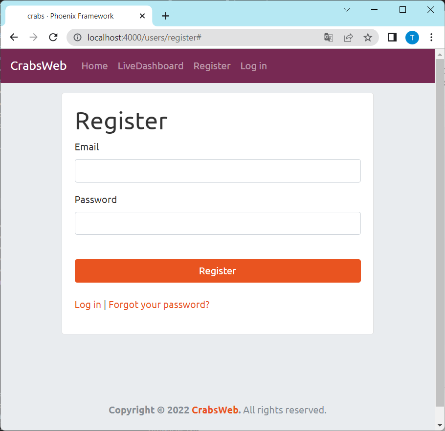
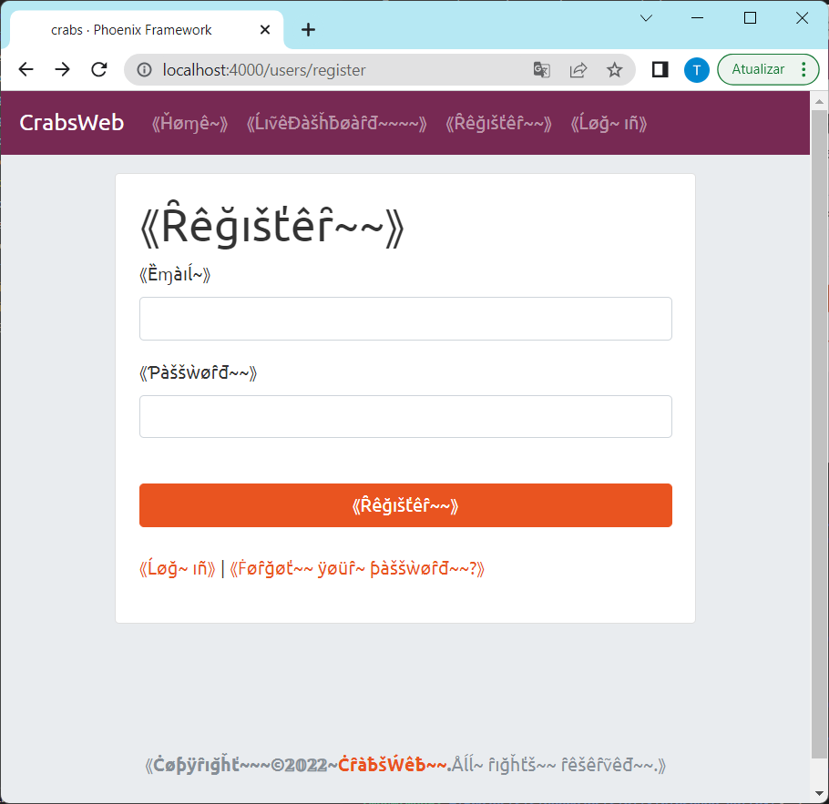

# PseudoGettext

A Gettext-compatible backend that adds support for
[pseudolocalization](https://en.wikipedia.org/wiki/Pseudolocalization).
Pseudolocalization can help you catch localization bugs earlier in the development process.

## Installation

This package is [available in Hex](https://hex.pm/docs/publish)
It can be installed by adding `pseudo_gettext` to your list of dependencies
in `mix.exs`:

```elixir
def deps do
  [
    {:pseudo_gettext, "~> 0.1.0"}
  ]
end
```

Documentation is generated with [ExDoc](https://github.com/elixir-lang/ex_doc)
and published on [HexDocs](https://hexdocs.pm).
The complete documentation can be found at <https://hexdocs.pm/pseudo_gettext>.

## Why Pseudolocalization?

From [Wikipedia](https://en.wikipedia.org/wiki/Pseudolocalization):
  
> Pseudolocalization (or pseudo-localization) is a software testing method
> used for testing internationalization aspects of software.
> Instead of translating the text of the software into a foreign language,
> as in the process of localization, the textual elements of an application
> are replaced with an altered version of the original language.
>
> These specific alterations make the original words appear readable,
> but include the most problematic characteristics of the world's languages:
> varying length of text or characters, language direction,
> fit into the interface and so on.

Pseudolocalization usually does the following:

  * Replace each latin character with a slightly modified version,
    which is still legible (for example, `m → ɱ`, `j → ǰ`). This allows
    the programmer and users to visually distinguish text that has been
    internationalized (i.e. wrapped in a `gettext` call) from text that
    hasn't been internationalized. The fact that we convert characters
    into characters that are visually similar means that the text remains
    readable.
  
  * Replace arabic numerals (i.e. latin digits) as we did above.
    The goal is the same: to have arabic numerals that are visually
    distinct but understandable.
  
  * Add extra tilde (`~`) characters to words to make them ~35% longer.
    This allows us to identify UI elements that are too inflexible for
    languages that may take up more space than English.
    As a rule of thumb, one should assume that foreign language strings
    are 35% longer in other languages.
    
  * Surround the string with `"⟪"` and `"⟫"` so that you can idenify messages
    that are to big for the containing element (those messages will be clipped
    and the text won't be surrounded by `"⟪"` and `"⟫"` on both sides).
    
  * Other characters (non-latin characters, punctuation characters, etc.)
    are not touched by the localization process.

This can (and should!) be used in development to identify internationalization
problems before they hit production.

## Usage

This is a drop-in replacement for `Gettext`.
You can just replace:

```elixir
use Gettext, otp_app: :my_app
```

by

```elixir
use PseudoGettext, otp_app: :my_app
```

To activate pseudolocalization of plain text, you need to set
the gettext locale to `"en-pseudo_text"` with `Gettext.set_locale("en_pseudo_text")`.
To activate pseudolocalization of HTML (which respects HTML tags and attributes),
you need to set the gettext locale to `"en-pseudo_html"` with `Gettext.set_locale("en_pseudo_html")`.

These locales are hardcoded and can't be easily extended.
Extending these locales or adding config options is on the (tenuous) roadmap.

IF you want to set the locale globally for your application (which is what you often want in development),
you can use the `PseudoGettext.set_global_locale/1` function.
If you start your application with IEx, you can simply use `PseudoGettext.set_global_locale("en-pseudo_html")`.
Another approach is to set the global locale as a config option:

```elixir
# config/dev.exs
config :pseudo_gettext, :locale, "en-pseudo_html"
```

This is actually a very good option in development, becuase it allows you to detect
internationalization issues earlier.

## Demo

In a normal Phoenix application, there is usually a `MyAppWeb.Gettext` module
such as this one:

```elixir
defmodule CrabsWeb.Gettext do
  @moduledoc """
  A module providing Internationalization with a gettext-based API.
  """
  use Gettext, otp_app: :crabs
end
```

We can add support for pseudolocalization by replacing `use Gettext, ...`
by `use PseudoGettext, ...`:

```elixir
defmodule CrabsWeb.Gettext do
  @moduledoc """
  A module providing Internationalization with a gettext-based API.
  """
  use PseudoGettext, otp_app: :crabs
end
```

The rest of the application requires no changes.

Say we have a user registration form the application.
It could look like this:



By starting the application with the config option above (`config :pseudo_gettext, :locale, "en-pseudo_html"`)
or using the IEx console (`PseudoGettext.set_global_locale("en-pseudo_html")`) we can activate
pseudolocalization. The login form should now look like this:



As you can see, most user-visible text has been replaced by unicode symbols
similar to latin letters. The text remains quite readable throughout.
You can see that on the top left corner, the application name is not properly
internationalized.

When we inspect the source code, we can see the reason:

```heex
<%# root.html.heex %>
...
  <a class="navbar-brand" href="#">CrabsWeb</a>
...
```

The name of the application is a static string in the `.heex` template,
which is not internationalized. To properly internationalize the application name,
you must wrapp it in `(d)gettext`:

```heex
<%# root.html.heex %>
...
  <a class="navbar-brand" href="#"><%= dgettext("accounts", "CrabsWeb") %></a>
...
```

If you reload the page, the app's branding will be properly internationalized:


By setting the global locale to `nil` (i.e. `PseudoGettext.set_global_locale(nil)`)
you can deactivate pseudolocalization and revert to the default locale:


This short demo illustrates the workflow one could follow to ensure the application
is properly internationaluzed throughout development. If one develops with pseudolocalization
active most of the time, these small errors are easy to find and correct.
